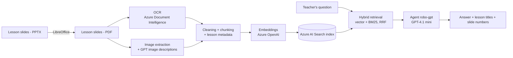

# RobocodeAgent

An AI assistant for teachers, built on **retrieval-augmented generation (RAG)**. A teacher asks a question about a lesson, and the assistant answers it using the school's own slide decks, and shows which lessons and slides the answer came from.

It was built to lower the school's costs by automating teachers' lesson preparation: instead of searching through slides by hand, the teacher asks and gets a grounded answer.

**Tech:** Python, Azure Document Intelligence, Azure OpenAI (embeddings), Azure AI Search, Azure AI Foundry (GPT-4.1 mini agent)

## A note on the data

The lesson slides used in this project are private and belong to **Robocode**, so they are not included in this repository. The tool itself is not tied to them: anyone can use it with their own slides, since the pipeline works for any set of PPTX or PDF lesson decks. Add your own presentations, run the pipeline, and you get an assistant for your own course materials.

## How it works



### 1. Data preparation (offline)

- **PPTX to PDF:** `pptx_to_pdf.py` converts PowerPoint decks to PDF with headless LibreOffice. It searches the input folder recursively, and when a folder holds several `.pptx` files it keeps only the Polish version (the file ending in `PL.pptx`). Output goes to `dataset/<subject>/`.
- **OCR:** `process_ocr.py` runs every lesson PDF through Azure Document Intelligence and stores the result as JSON.
- **Cleaning and chunking:** `build_dataset.py` cleans the OCR text per slide and splits it into chunks. Very short chunks are merged, and a sanity check prints the chunk length distribution (min, median, max words).
- **Image descriptions:** images found in the PDFs are described by GPT and appended to the text of the slide they belong to, so diagrams end up in the same chunk as the slide's text. Descriptions are cached, so they are generated only once.
- **Metadata:** every chunk keeps its subject, lesson id and title, source file and slide numbers.
- **Output:** one `chunks.jsonl` file per subject, ready to be embedded and indexed.

### 2. Question answering (online)

`rag_query.py` is the core module. It is a reusable module rather than a one-off script, so the CLI and the evaluation script share the same logic.

- **Hybrid retrieval:** the question is embedded and sent to Azure AI Search together with the raw text, which combines vector search (kNN) and keyword search (BM25) using Reciprocal Rank Fusion. This works on the Free tier of Azure AI Search.
- **Automatic lesson filter:** if the question mentions a lesson ("lekcja 4", "lekcji 11-12", "L4"), results are limited to that lesson. An optional subject filter is also supported.
- **Generation:** the retrieved chunks are passed as context to an Azure AI Foundry agent (`robo-gpt`, GPT-4.1 mini).
- **Output:** `ask()` returns the answer plus the lesson titles and slide numbers of the chunks it used.

## Evaluation

`eval_retrieval.py` measures retrieval quality automatically with **Recall@k** and **MRR**.

The ground truth is a JSON file of questions with the slides that should be found, and the key points a good answer should contain:

```json
{
  "question": "Czym jest prąd elektryczny",
  "relevant_slides": ["1.2"],
  "expected_answer_points": [
    "przepływ elektronów",
    "bardzo małe, niewidoczne cząsteczki"
  ]
}
```

`"1.2"` means lesson 1, slide 2. A question counts as a hit if any retrieved chunk covers any of its relevant slides. The report lists the questions that were missed, and a `--debug` mode prints what was retrieved to help diagnose mismatches.

```bash
python eval_retrieval.py --eval-set questions.json --k 5 --output eval_output.json
```

Options: `--k` (top-k), `--subject` (subject filter), `--debug`.

## Setup

1. Create a Python environment and install the dependencies:
   ```bash
   pip install -r requirements.txt
   ```
2. Create a `.env` file in the project root with your Azure settings:
   ```env
   AZURE_DOCUMENT_INTELLIGENCE_ENDPOINT=
   AZURE_DOCUMENT_INTELLIGENCE_KEY=
   AZURE_SEARCH_ENDPOINT=
   AZURE_SEARCH_KEY=
   AZURE_SEARCH_INDEX_NAME=
   AZURE_OPENAI_ENDPOINT=
   AZURE_OPENAI_KEY=
   AZURE_OPENAI_EMBEDDING_NAME=
   AZURE_OPENAI_CHAT_ENDPOINT=
   AZURE_OPENAI_CHAT_KEY=
   AZURE_OPENAI_CHAT_NAME=
   ```
   Never commit this file. `validate_config()` reports any missing variable.
3. Install [LibreOffice](https://www.libreoffice.org/) and make sure `libreoffice` is available on your PATH (only needed to convert PPTX files).
4. Azure resources needed: Document Intelligence, Azure OpenAI with an embedding deployment, an Azure AI Search index with a vector field `content_vector`, and an AI Foundry agent named `robo-gpt`.

## Usage

Your lesson decks can be PPTX or PDF. PDFs go in `dataset/<subject>/`.

```bash
# 0. (only for PPTX) convert the presentations to PDF
python pptx_to_pdf.py --subject-name <subject> --input <folder with .pptx files>
#    run it from the scripts folder: the PDFs are written to ../dataset/<subject>/

# 1. OCR the slides
python process_ocr.py

# 2. Clean, add image descriptions, chunk
python data_preparation/build_dataset.py --subject-name <subject>
#    add --debug-images to print the first image descriptions for a quality check

# 3. Embed the chunks and upload them to the search index
python index_chunks.py

# 4. Ask questions in an interactive CLI
python cli_test.py
```

The CLI prints the answer and the retrieved lessons and slides for each question, and logs every interaction so prompts can be iterated on.

## Possible next steps

- Tighten the agent's instructions so it answers strictly from the retrieved slides.
- Use `expected_answer_points` to evaluate the quality of the generated answers, not just retrieval.
- Generate a synthetic question set from the indexed chunks for regression testing after every change.
- Deploy a chat for students